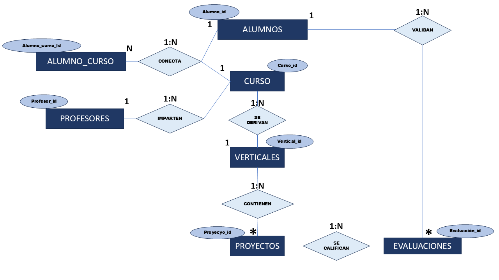
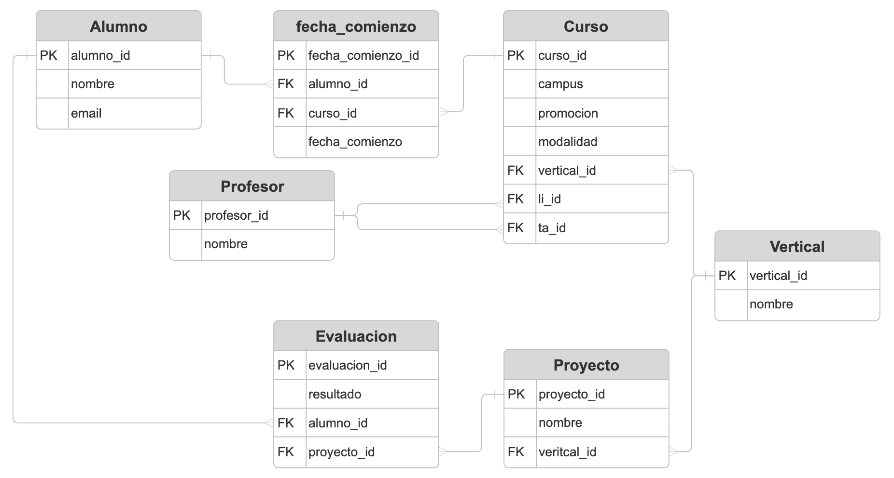

# Proyecto de Creación de Base de Datos Relacional


---

## Descripción

Bienvenido a nuestro proyecto de creación de una **Base de Datos Relacional (SQL)** desarrollado en **Python + PostgreSQL**. Este proyecto nace a partir de un conjunto de datos sin normalizar. Los datos simulan una escuela de bootcamps, incluyendo estudiantes y profesores.

El objetivo es aplicar principios de **modelado de datos**, **normalización**, y **gestión con PostgreSQL**, para obtener una base de datos robusta y accesible desde aplicaciones externas.

El proyecto está pensado para ser **modular, escalable y mantenible**, con posibilidad de ampliar campus, promociones, verticales (Data Science, Full Stack...), modalidades (online/presencial) y más.

## Objetivos

- Diseñar un modelo E/R representativo de los datos.
- Aplicar técnicas de normalización (1FN, 2FN, 3FN).
- Crear el modelo lógico y físico de la base de datos.
- Cargar la base de datos en un servicio externo como Render.
- Garantizar integridad, consistencia y eficiencia de los datos.

---

## Tareas a Realizar

### 1. Modelo Entidad-Relación (E/R)
- Identificar las entidades principales (estudiantes, profesores, cursos,etc).
- Definir atributos clave para cada entidad.
- Establecer relaciones entre entidades (uno a muchos, uno a uno, etc.).
- Representar el modelo E/R mediante un diagrama.

### 2. Modelo Lógico de la Base de Datos
- Traducir el modelo E/R a tablas con atributos, tipos de datos, claves primarias y foráneas.
- Confirmar las restricciones de integridad referencial.

### 3. Normalización de Datos
- Analizar los datos crudos.
- Aplicar procesos de normalización (1FN, 2FN, 3FN) para:
  - Eliminar redundancias.
  - Asegurar integridad.
  - Mejorar eficiencia en consultas y actualizaciones.

### 4. Creación de la Base de Datos (PostgreSQL)
- Crear scripts SQL para:
  - Crear las tablas.
  - Insertar los datos.
  - Consultas básicas de prueba.
- Utilizar PostgreSQL como sistema gestor de base de datos.
- Verificar consistencia del esquema con datos ficticios.

### 5. Despliegue en Render
- Configurar una cuenta en [Render](https://render.com/).
- Crear un servicio de base de datos PostgreSQL gratuito.
- Compartir URL.

---

## Tecnologías y Herramientas

- **PostgreSQL**
- **Python** (`pandas`)
- **Render** (hosting de la base de datos)
- **Herramientas de modelado lógico**: [SmartDraw](https://app.smartdraw.com/)
- **Herramientas para modelo E/R**: Microsoft Office
- **SQL** para creación y consultas


---

## Estructura del Proyecto

```
proyecto-bd-relacional/
├── README.md
├── asset
│   └── portada.png
├── docs/
│   └── modelo-er.png
|   └── modelo-logico.png
|   └── render-config.md  
├──  scripts/
│   ├──  create_tables_and_inserts.sql
│   └──  python_parse_CSVs.py
├──  data/
│   └──  clase_1.csv
│   └──  clase_2.csv
│   └──  clase_3.csv
│   └──  clase_4.csv
│   └──  claustro.csv
```


## Despliegue

La base de datos está disponible públicamente desde Render. Si quieres acceder a la BBDD puedes pedirnos la clave de acceso.

- **Base de Datos**: `Base de datos relacional The Bridge`
- **host** = "dpg-d10qkg3e5dus73ajo0og-a.frankfurt-postgres.render.com"

---

## Diagrama Entidad-Relación



---

## Diagrama Lógico de la Base de Datos



---


## Cómo usar este proyecto

1. Clonar el repositorio:
   ```bash
   git clone https://github.com/sebastian438/project_db_01_group1.git
   ```
2.Ver y ejecutar los scripts en tu entorno PostgreSQL.

---

##  Contacto

¡Gracias por visitar nuestro proyecto! Somos Daniel, Olga, Markel, Kike, Sebastian y Ana. Esperamos que sea útil e inspirador para tus propios desarrollos con bases de datos relacionales.

---


